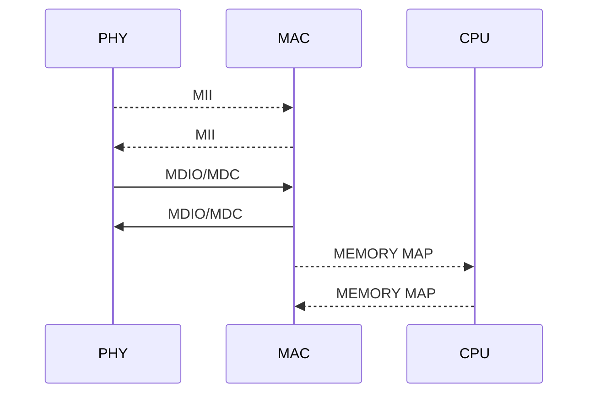

> Данная статья является переводом с китайского языка. <br>Оригинал статьи находится тут https://www.jianshu.com/p/77bb0ba1768c
## **Phy-система Linux**


> Микросхема PHY - это самый низкий уровень OSI - физического уровня, подключаемый к микросхеме MAC (уровень канала передачи данных) через MII. Чтобы получить дополнительные знания о MAC и PHY, вы можете прочитать [простой анализ взаимодействия Mac и Phy](https://links.jianshu.com/go?to=http%3A%2F%2Fwww.360doc.com%2Fcontent%2F13%2F0717%2F16%2F2768962_300623597.shtml)

Общая схема соединения PHY и MAC:


Аппаратная система PHY относительно сложна: 
PHY подключен к MAC, 
MAC подключен к CPU, 
PHY и MAC подключены через MII и MDIO / MDC.
MII предназначен для сетевых данных, а MDIO/MDC используется для связи с регистрами PHY. 

Как и предыдущий анализ драйверов I2C / SPI, статья разделена на драйверы контроллера и драйверы устройств.

#### **1. Управление контроллером**
Драйвер контроллера использует тот же метод подключения, что и шина платформы. Добавьте платформу phy в arch или dts, и `platform_driver`регистр обычно помещается в ```/driver/net/phy/```. После совпадения имени устройства и драйвера, `platform_driver`интерфейс драйвера, соответствующий структуре реализации, аналогичен следующему:
```c
static struct platform_driver pfe_platform_driver = {
    .probe = pfe_platform_probe,
    .remove = pfe_platform_remove,
    .driver = {
        .name = "pfe",
#ifdef CONFIG_PM
        .pm = &pfe_platform_pm_ops,
#endif
    },
};

static int __init pfe_module_init(void)
{
    return platform_driver_register(&pfe_platform_driver);
}

static void __exit pfe_module_exit(void)
{
    platform_driver_unregister(&pfe_platform_driver);
}

MODULE_LICENSE("GPL");
module_init(pfe_module_init);
module_exit(pfe_module_exit);
```  
  
Поскольку для связи phy и cpu используется MII и MDIO/MDC для управления передачей, если вы хотите настроить шину MII в функциях проверки, в конце вызовите `mdiobus_register()`или `of_mdiobus_register()` и зарегистрируйте mdio_bus.

`of_mdiobus_register()`функция расположена в файле`drivers/of/of_mdio.c`, функция по-прежнему будет вызывать `mdiobus_register()` в конце, `
mdiobus_register()`функция расположена `drivers/net/phy/mdio_bus.c`, 
В итоге у нас получится следующий алгоритм:
```c
 ‐‐> mdiobus_register
     ‐‐> device_register
     ‐‐> mdiobus_scan
         ‐‐> get_phy_device
             ‐‐> get_phy_id         // Читаем регистр
                 ‐‐> phy_device_create  // Создаем phy устройство
                 ‐‐> INIT_DELAYED_WORK(&dev‐>state_queue, phy_state_machine); //Инициализируем конечный автомат
```  
Это передача контроллера и устройства. Создайте физическое устройство для инициализации конечного автомата физического уровня. Далее, все зависит от драйвера устройства.

#### **2. Драйвер устройства**

У драйвера устройства также есть три аспекта: устройство, драйвер и шина. 
Интерфейс устройства PHY - это `phy_device_register`вместе с `phy_device_release`.
Интерфейс драйвера - это `phy_driver_register`вместе с `phy_driver_unregister`. 
Интерфейс шины - `mdiobus_register`вместе с `mdiobus_unregister`.

Таким образом, все становится понятнее, а содержание драйверов для PHY находится в ```/drivers/net/phy```.

Драйвер phy-устройства не имеет функции board_info для добавления таких устройств, как i2c/spi, он непосредственно считывает регистры в phy. Согласно правилам IEEE, содержимое первых 16 регистров PHY-чипа должно быть исполнено следующим образом:


Среди них регистры 0x02 и 0x03 являются старшими и младшими битами идентификатора устройства. Каждый тип PHY имеет строку идентификаторов, которые мы можем узнать, проверив руководство.

Используйте драйвер устройства, чтобы в ```MODULE_DEVICE_TABLE```добавить соответствующий идентификатор устройства, и его эффект можно понять как содержимое, достигаемое функцией board_info, например, таблицей broadcom:
```c
static struct mdio_device_id __maybe_unused broadcom_tbl[] = {
    { PHY_ID_BCM5411, 0xfffffff0 },
    { PHY_ID_BCM5421, 0xfffffff0 },
    { PHY_ID_BCM54210S, 0xfffffff0 },
    { PHY_ID_BCM5461, 0xfffffff0 },
    { PHY_ID_BCM5464, 0xfffffff0 },
    { PHY_ID_BCM5482, 0xfffffff0 },
    { PHY_ID_BCM5482, 0xfffffff0 },
    { PHY_ID_BCM50610, 0xfffffff0 },
    { PHY_ID_BCM50610M, 0xfffffff0 },
    { PHY_ID_BCM57780, 0xfffffff0 },
    { PHY_ID_BCMAC131, 0xfffffff0 },
    { PHY_ID_BCM5241, 0xfffffff0 },
    { }
};

MODULE_DEVICE_TABLE(mdio, broadcom_tbl);
```
`phy_driver` - Реестр, вероятно, представляет собой следующий процесс для простого анализа:
```c
drivers/net/phy/phy_device.c
phy_init
    ‐‐> mdio_bus_init // Зарегистрировать шину mdio
       ‐‐> class_register(&mdio_bus_class);
       ‐‐> bus_register(&mdio_bus_type);
 ‐‐> phy_driver_register(&genphy_driver);
```
Он будет вызываться при регистрации шины mdio `mdio_bus_match`. Если функция сопоставления обнаружит устройство, она зарегистрирует драйвер устройства. Функция сопоставления расположена в `/drivers/net/phy/mdio_bus.c`, как показано ниже, для печати phy_id.

```c
static int mdio_bus_match(struct device *dev, struct device_driver *drv)
{
    struct phy_device *phydev = to_phy_device(dev);
    struct phy_driver *phydrv = to_phy_driver(drv);
    
    printk("phydev->phy_id:%x ",phydev->phy_id);
    printk("phydrv->phy_id:%x \n",phydrv->phy_id);
    
    return ((phydrv->phy_id & phydrv->phy_id_mask) ==
        (phydev->phy_id & phydrv->phy_id_mask));
}
```
Из журнала видно, что идентификатор устройства dev - 600d8595, затем ищется идентификатор соответствующего драйвера drv. Если 600d8595 найден, вводится функция проверки.
```c
[   23.306611] phydev->phy_id:600d8595 phydrv->phy_id:ffffffff
[   23.312150] phydev->phy_id:600d8595 phydrv->phy_id:ffffffff
[   23.317731] phydev->phy_id:600d8595 phydrv->phy_id:4dd072
[   23.323084] phydev->phy_id:600d8595 phydrv->phy_id:4dd033
[   23.328461] phydev->phy_id:600d8595 phydrv->phy_id:206070
[   23.333812] phydev->phy_id:600d8595 phydrv->phy_id:2060e0
[   23.339182] phydev->phy_id:600d8595 phydrv->phy_id:600d8595
```
После того, как идентификатор будет найден, драйвер устройства будет зарегистрирован, и соответствующая `phy_driver_register()`функция вернет успех, `phy_driver`и будет выполнено следующее содержимое структуры, как показано ниже:
```c
static struct phy_driver bcm54210s_driver = {
    .phy_id     = PHY_ID_BCM54210S,
    .phy_id_mask    = 0xfffffff0,
    .name       = "Broadcom BCM54210S",
    .features   = PHY_GBIT_FEATURES |
              SUPPORTED_Pause | SUPPORTED_Asym_Pause,
    .flags      = PHY_HAS_MAGICANEG | PHY_HAS_INTERRUPT,
    .config_init    = bcm54210s_config_init,
    .config_aneg    = bcm54210s_config_aneg,
    .read_status    = bcm54210s_read_status,
    .ack_interrupt  = bcm54xx_ack_interrupt,
    .config_intr    = bcm54xx_config_intr,
    .driver     = { .owner = THIS_MODULE },
};
```
Начальная конфигурация регистров phy и т.д., вот краткое введение в драйвер PHY, есть еще много о PHY, например: **конечный** **автомат PHY** , **инструменты ethtool,** которые необходимы в более поздних приложениях. Я буду изучать и резюмировать после того, как изучу глубоко.

Анализ phy-системы Linux находится здесь, и он будет продолжать обновляться.

> **Примечание**. Приведенный выше контент - это часть моего опыта, накопленного в процессе обучения. Я неизбежно буду ссылаться на некоторые знания из других статей. Если есть какие-либо нарушения, пожалуйста, сообщите мне вовремя. Я удалю или помечу источник контента вовремя. Укажите, обсудите и изучите. Эта статья представляет собой всего лишь руководство. Подробное содержание анализа данных можно найти в руководствах по Linux. Спасибо за внимание.